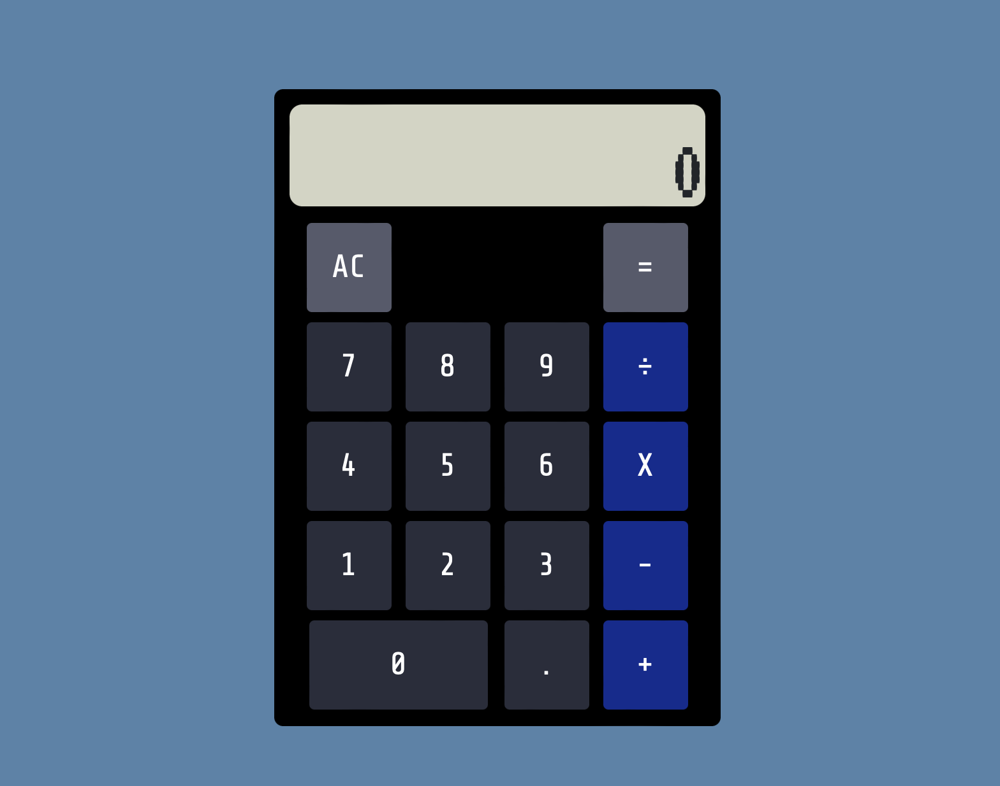

# fcc-javascript-calculator

This was made as part of the freeCodeCamp Front End Development Libraries curriculum.

## How to Use:

1. Press some numbers.
2. Press a non-number.
3. Press more numbers.
4. Press the equal sign.
5. Profit!

To see this live, please visit its CodePen page: https://codepen.io/macgirl212/full/jOwjJxo
